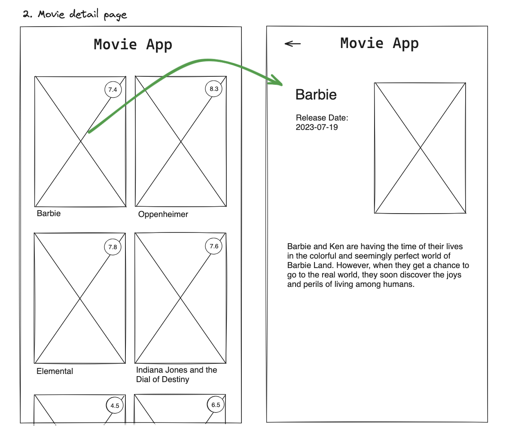

# Title

## Value Proposition

**As a** `movie fan`  
**I want to** `click on a movie and see it's details.`  
**so that** `I know what the movie is about and when it came out.`  

## Description

## Acceptance Criteria

- I want to be able to click on any movie, redirecting me to a details page for the movie.
- On the details page I want to view the title, release date, cover and description.
- I need a way to navigate back to the movies list.

## Tasks

- Make a new movie details page.
- Display title, release date, cover and description of the movie.
- Implement a back button to navigate back to the homepage.
